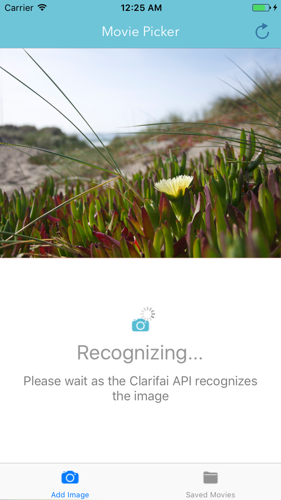

# :tada: MoviePicker :tada:

 Use Clarifai API to pick movies from TMDB by recognizing images.

##Setup

Requires following dependencies:
`Alamofire`
`SwiftyJSON`

Use CocoaPods to install these dependencies. 

Run the command:

`pod install` to install the dependencies.

Open MoviePicker.xcworkspace to access the files after installation.

##App functionality

Add Image to get the appropriate tags from Clarifai API for the image. 
Then select a tag to get related keywords from TMDB API.
A table of related movies should be presented according to the selected keyword.
Save image and view saved images tab to check out the previously saved images.

## Screenshots

